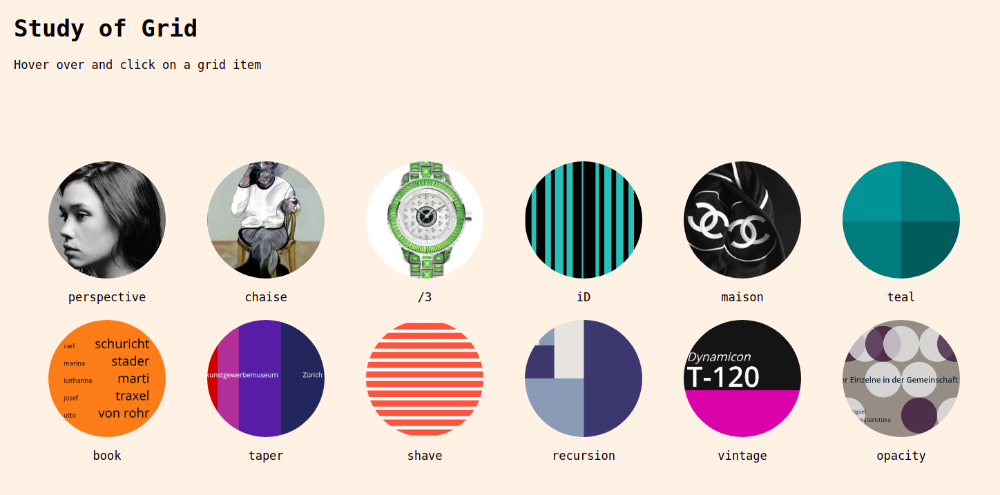

# Study of Grid

This project is an exploration of aesthetic layouts and design using Flexbox and CSS Grid. I wanted to see how far I could get with just CSS3 and HTML.

❗Note: I do not use any SVG in this project.

## Sneak peak:



## Locally Hosting

Using npm:

```
npm install
```

Start the app:

```
npm start
```

## Public URL

The project is also deployed on Netlify. Check out this [link](https://study-of-grid.netlify.app/). 

## Credits

Special thanks to Jen Simmons (Mozilla) and her amazing [YouTube](https://www.youtube.com/channel/UC7TizprGknbDalbHplROtag). I highly recommend it to anyone learning CSS Grid and Flexbox.